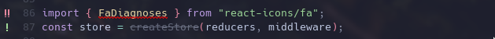
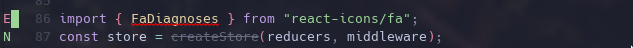
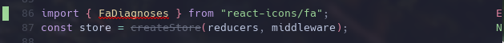
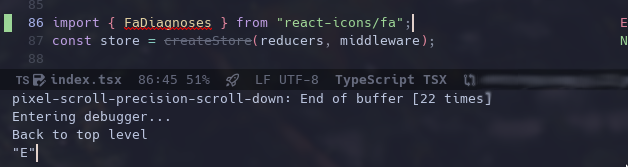

# flymake-margin

A package to provide Emacs Flymake marks into the margin world.

Turn this:



Into this:



or 



Freeing the fringe for other modes, `diff-hl` here (the green block marking
a git insertion) and making flymake marks usable on Emacs TUI. 

You can use any string you like, UTF-8 symbols, emojis and others.

**IMPORTANT:** Emacs 30 will have this feature built-in, so only use it
if stuck with Emacs < 30 or it serves you another porpuse.


## Motivation

It's been a long time since I've been wanting to get my Emacs config 
closer to Emacs core packages.


There's nothing wrong with great flycheckers and 3rd party packages around, 
but even for the sake of "trying out flymake" I couldn't let my actual working 
config broken or half backed for some reason or another.


Time passed and flymake got more mature, the only feature miss keeping me from migrating
to it was lack of TUI Emacs full support. Meaning I needed it to work on the margin,
since fringes are not present in TUI Emacs.


It was then that I stumbled upon this [post](
https://www.reddit.com/r/emacs/comments/1bawdau/making_flymake_supports_error_indicators_in_margin/)
by Reddit user [DevelopmentCool2449](https://www.reddit.com/user/DevelopmentCool2449/).
This package is strongly inspired by the user tip. Thanks!


## Installation

Download `flymake-margin.el` to some directory like `~/.emacs.d/flymake-margin/`.


Modify your init file to load it:

```lisp
(add-to-list 'load-path "~/.emacs.d/flymake-margin/")
(require 'flymake-margin)
(flymake-margin-mode t)
```

Or you can install it with straight:

```lisp
(use-package flymake-margin
  :straight (margin :type git
                    :host github
                    :repo "LionyxML/flymake-margin"
                    :files ("*.el"))
  :after flymake
  :config
  (flymake-margin-mode t))
```

Still not available on MELPA and similar repositories (yet).


## Usage

Simply start `flymake-margin-mode` before flymake.


## Customizations

You can customize several options with `M-x customize-group RET flymake-margin RET`:


- `flymake-margin-error-symbol`. String. Defaults to "E".
- `flymake-margin-warning-symbol`. String. Defautls to "W".
- `flymake-margin-note-symbol`. String. Defaults to "N".
- `flymake-margin-side`. Options `left` or `right`. Defaults to `left`.
- `flymake-margin-get-margin-symbol-default`. String. Defaults to " " (space char).


## Utilitary functions

Margin conflicts are very common between modes that want to use the margin.


Possible solutions are: 
- using fringe (if GUI is available).
- changing margin sides.


I am suggesting a new approach to integrate with packages that would like some
sort of "merging symbols" with flymake.


The utilitary function `flymake-get-margin-symbol`, can be called interactively with
the cursor at any position of the buffer.


If the line is marked by `flymake`, the function returns the equivalent symbol. This
would provide, for example, for other packages to ask the flymake margin "content" 
and merge it with its own implementation. Example: one `git-gutter` like package
could get the line margin content, use it to pass to a new margin draw with the
background changed, thus marking the git state with the background color while
re-printing the flymake content symbol.


An example of running such a function on line 86 with `M-: flymake-get-margin-symbol RET`.





This function can also receive a beginning and end position as optional parameters.


We also provide two hooks to run after `flymake-margin-mode` is either set or unset:


- `flymake-margin-mode-hook`. Runs when mode starts.
- `flymake-margin-mode-off-hook`. Runs when mode turns off.
